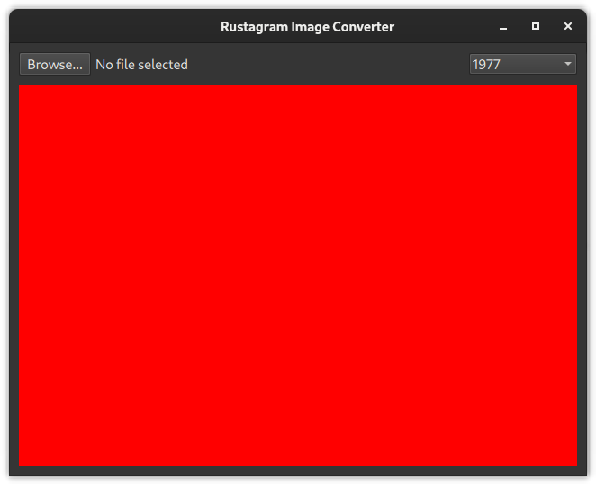

# Creating the QML GUI

The goal of this part is to add a QML GUI for our application.
For now, we can leave out loading an actual file.
You can just use a rectangle as a placeholder for now.

In the end it should look similar to this:


The red rectangle serves as a placeholder for our filtered image.

✅ Add the control elements to `qml/main.qml`

You can use [Qt Quick Controls 2](https://doc.qt.io/qt-6/qtquickcontrols-index.html) for this.
The list of available QML types is listed [in the Qt documentation](https://doc.qt.io/qt-6/qtquick-controls-qmlmodule.html).

The controls should include:
* ✅ A [`Button`](https://doc.qt.io/qt-6/qml-qtquick-controls-button.html) to browse files
* ✅ A [`Label`](https://doc.qt.io/qt-6/qml-qtquick-controls-label.html) showing the currently selected file.
* ✅ A [`ComboBox`](https://doc.qt.io/qt-6/qml-qtquick-controls-combobox.html) that should include:
```qml
"1977",
"nineteenseventyseven",
"aden",
"brannan",
"brooklyn",
"clarendon",
"earlybird",
"gingham",
"hudson",
"inkwell",
"kelvin",
"lark",
"lofi",
"maven",
"mayfair",
"moon",
"nashville",
"reyes",
"rise",
"slumber",
"stinson",
"toaster",
"valencia",
"walden",
```

✅ Lay out the Control elements using [layouts](https://doc.qt.io/qt-6/qtquicklayouts-index.html)

✅ Add a [`Rectangle`](https://doc.qt.io/qt-6/qml-qtquick-rectangle.html) as a placeholder for our image converter

✅ Hook up the `Browse...` button to open a [`FileDialog`](https://doc.qt.io/qt-6/qml-qtquick-dialogs-filedialog.html).
